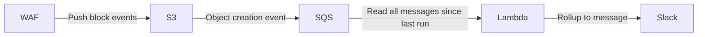

## WAF Notification Lambda

A Lambda function that analyzes WAF logs and automatically reports blocked IP addresses in Slack.

### How it works

### Configuration

| Field                   | Type     | Env Variable                                             | Required | Default               | Usage                                                         |
|--------------------------|----------|----------------------------------------------------------|----------|-----------------------|---------------------------------------------------------------|
| Bucket                  | string   | `SKPR_WAF_NOTIFICATION_LAMBDA_BUCKET`                    | Yes      | -                     | Bucket to pull S3 objects from                                |
| QueueURL                | string   | `SKPR_WAF_NOTIFICATION_LAMBDA_SQS_QUEUE_URL`             | Yes      | -                     | SQS Queue URL to read messages from                           |
| BatchSize               | int      | `SKPR_WAF_NOTIFICATION_LAMBDA_BATCH_SIZE`                | No       | 100                   | Number of IPs to send in each Slack message                   |
| Webhooks                | []string | `SKPR_WAF_NOTIFICATION_LAMBDA_SLACK_WEBHOOKS`            | Yes      | -                     | Slack webhook URLs to send messages to                        |
| IPInfoToken             | string   | `SKPR_WAF_NOTIFICATION_LAMBDA_IPINFO_TOKEN`              | Yes      | -                     | Token for authenticating with IPInfo.io                       |
| AllowedRulesIDs         | []string | `SKPR_WAF_NOTIFICATION_LAMBDA_ALLOWED_RULES_IDS`         | Yes      | -                     | Comma-separated list of allowed WAF rule IDs                  |
| SlackMessageTitle       | string   | `SKPR_WAF_NOTIFICATION_LAMBDA_SLACK_MESSAGE_TITLE`       | No       | WAF Blocked IPs       | Title for the Slack message                                   |
| SlackMessageDescription | string   | `SKPR_WAF_NOTIFICATION_LAMBDA_SLACK_MESSAGE_DESCRIPTION` | No       | The following IPs...  | Description for the Slack message                             |
